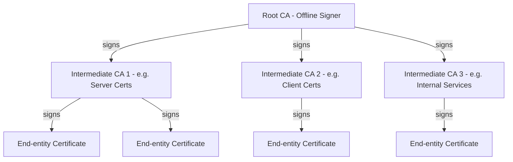
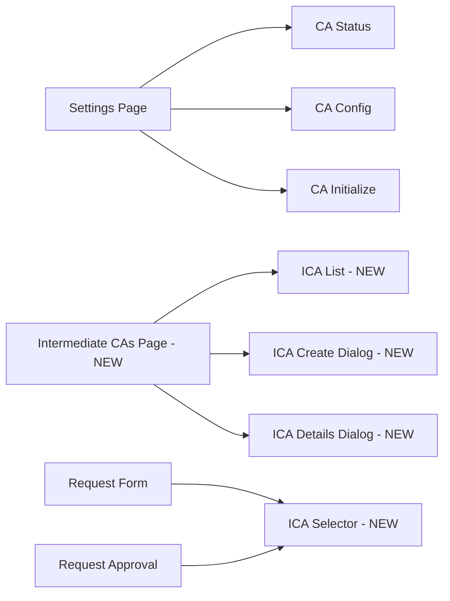

# Intermediate CA Support — Architecture Document

## 1. Overview

This document describes the architecture for adding **Intermediate Certificate Authority (CA) support** to SimpleCertManager. The current system supports a single Root CA that directly signs end-entity certificates. The new architecture introduces a full CA hierarchy:

```
Root CA → Intermediate CA(s) → End-entity Certificates
```

### Goals

1. Support **multiple Intermediate CAs** signed by the Root CA
2. Ability to **select which Intermediate CA** to use when signing a certificate
3. Full **certificate chain** handling (Root → Intermediate → End-entity)
4. **Backward compatibility** with existing Root CA installations
5. Each Intermediate CA has its **own passphrase**, independent of the Root CA passphrase

### Current Architecture Summary

| Component | Current State |
|---|---|
| **Database** | Single `ca_config` collection stores one Root CA record |
| **File Storage** | `storage/ca/ca-cert.pem` and `storage/ca/ca-key.pem` — single flat directory |
| **Backend Service** | [`caService.js`](backend/src/services/caService.js) — all functions assume a single CA |
| **Certificate Signing** | [`certificateService.js`](backend/src/services/certificateService.js) — always signs with Root CA |
| **CRL** | [`crlService.js`](backend/src/services/crlService.js) — single CRL for Root CA |
| **Frontend** | [`Settings.jsx`](frontend/src/pages/Settings.jsx) — shows single CA status/config |

---

## 2. CA Hierarchy Design



### Key Design Decisions

- The **Root CA** remains the trust anchor; its private key is only needed when creating/revoking Intermediate CAs
- **Intermediate CAs** are the day-to-day signing authorities for end-entity certificates
- Each Intermediate CA has its **own encrypted private key and passphrase**
- The Root CA can still directly sign certificates (backward compatibility), but the UI will encourage using Intermediate CAs
- **Serial numbers** remain globally managed by the Root CA `ca_config` record to avoid collisions
- Each Intermediate CA can have its **own CRL distribution point**

---

## 3. Database Schema Changes

### 3.1 New Collection: `intermediate_cas`

A new PocketBase collection to store Intermediate CA records.

```json
{
  "id": "intermediate_cas_col",
  "listRule": "@request.auth.id != ''",
  "viewRule": "@request.auth.id != ''",
  "createRule": "@request.auth.id != ''",
  "updateRule": "@request.auth.id != ''",
  "deleteRule": null,
  "name": "intermediate_cas",
  "type": "base",
  "fields": [
    {
      "name": "id",
      "type": "text",
      "primaryKey": true,
      "required": true,
      "system": true,
      "autogeneratePattern": "[a-z0-9]{15}",
      "min": 15,
      "max": 15,
      "pattern": "^[a-z0-9]+$"
    },
    {
      "name": "name",
      "type": "text",
      "required": true,
      "min": 1,
      "max": 255
    },
    {
      "name": "description",
      "type": "text",
      "required": false,
      "min": 0,
      "max": 1000
    },
    {
      "name": "common_name",
      "type": "text",
      "required": true,
      "min": 1,
      "max": 255
    },
    {
      "name": "organization",
      "type": "text",
      "required": false,
      "max": 255
    },
    {
      "name": "organizational_unit",
      "type": "text",
      "required": false,
      "max": 255
    },
    {
      "name": "country",
      "type": "text",
      "required": false,
      "max": 2,
      "pattern": "^[A-Z]{2}$"
    },
    {
      "name": "state",
      "type": "text",
      "required": false,
      "max": 255
    },
    {
      "name": "locality",
      "type": "text",
      "required": false,
      "max": 255
    },
    {
      "name": "email",
      "type": "email",
      "required": false
    },
    {
      "name": "serial_number",
      "type": "text",
      "required": true,
      "max": 255
    },
    {
      "name": "certificate_pem",
      "type": "text",
      "required": true,
      "max": 10000
    },
    {
      "name": "private_key_encrypted",
      "type": "text",
      "required": true,
      "max": 100
    },
    {
      "name": "key_size",
      "type": "number",
      "required": true,
      "min": 2048,
      "max": 4096,
      "onlyInt": true
    },
    {
      "name": "not_before",
      "type": "date",
      "required": true
    },
    {
      "name": "not_after",
      "type": "date",
      "required": true
    },
    {
      "name": "fingerprint_sha256",
      "type": "text",
      "required": true,
      "min": 64,
      "max": 64,
      "pattern": "^[a-f0-9]{64}$"
    },
    {
      "name": "path_length_constraint",
      "type": "number",
      "required": false,
      "min": 0,
      "max": 0,
      "onlyInt": true
    },
    {
      "name": "max_validity_days",
      "type": "number",
      "required": true,
      "min": 1,
      "max": 825,
      "onlyInt": true
    },
    {
      "name": "default_validity_days",
      "type": "number",
      "required": true,
      "min": 1,
      "max": 825,
      "onlyInt": true
    },
    {
      "name": "default_key_size",
      "type": "number",
      "required": true,
      "min": 2048,
      "max": 4096,
      "onlyInt": true
    },
    {
      "name": "crl_distribution_point",
      "type": "url",
      "required": false
    },
    {
      "name": "status",
      "type": "select",
      "required": true,
      "maxSelect": 1,
      "values": ["active", "revoked", "expired"]
    },
    {
      "name": "revoked_at",
      "type": "date",
      "required": false
    },
    {
      "name": "revocation_reason",
      "type": "select",
      "required": false,
      "maxSelect": 1,
      "values": [
        "unspecified",
        "keyCompromise",
        "caCompromise",
        "affiliationChanged",
        "superseded",
        "cessationOfOperation"
      ]
    },
    {
      "name": "created_by",
      "type": "relation",
      "required": true,
      "collectionId": "_pb_users_auth_",
      "maxSelect": 1,
      "cascadeDelete": false
    }
  ],
  "indexes": []
}
```

**Key fields explained:**
- `private_key_encrypted` — stores `"stored_on_disk"` placeholder (actual key is on filesystem, same pattern as Root CA)
- `path_length_constraint` — always `0` for Intermediate CAs (they cannot sign further sub-CAs)
- `max_validity_days` — maximum validity the Intermediate CA can grant to end-entity certs
- `status` — tracks whether the Intermediate CA is active, revoked, or expired

### 3.2 Modified Collection: `certificates`

Add a new optional field to track which CA signed the certificate:

| Field | Type | Required | Description |
|---|---|---|---|
| `issuing_ca_id` | relation → `intermediate_cas` | No | ID of the Intermediate CA that signed this cert. `null` means signed by Root CA directly |

### 3.3 Modified Collection: `certificate_requests`

Add an optional field for the user to specify which Intermediate CA should sign:

| Field | Type | Required | Description |
|---|---|---|---|
| `issuing_ca_id` | relation → `intermediate_cas` | No | Preferred Intermediate CA for signing. `null` means use default or Root CA |

### 3.4 Modified Collection: `audit_logs`

Add new audit action values:

| New Action Values |
|---|
| `create_intermediate_ca` |
| `revoke_intermediate_ca` |
| `update_intermediate_ca` |

Add new entity type value:

| New Entity Type Value |
|---|
| `intermediate_ca` |

---

## 4. File Storage Structure

### 4.1 Current Structure

```
storage/
  ca/
    ca-cert.pem          # Root CA certificate
    ca-key.pem           # Root CA encrypted private key
  certificates/
    {serial}.crt         # End-entity certificates
  private_keys/
    {serial}.key         # End-entity private keys
  crl/
    ca.crl               # Root CA CRL
```

### 4.2 New Structure

```
storage/
  ca/
    ca-cert.pem                    # Root CA certificate (unchanged)
    ca-key.pem                     # Root CA encrypted private key (unchanged)
    intermediate/
      {ica_id}/
        ica-cert.pem               # Intermediate CA certificate
        ica-key.pem                # Intermediate CA encrypted private key
        chain.pem                  # Full chain: Intermediate + Root
  certificates/
    {serial}.crt                   # End-entity certificates (unchanged)
  private_keys/
    {serial}.key                   # End-entity private keys (unchanged)
  crl/
    ca.crl                         # Root CA CRL (unchanged)
    intermediate/
      {ica_id}.crl                 # Per-Intermediate CA CRL
```

### 4.3 Constants Changes

In [`constants.js`](backend/src/config/constants.js):

```javascript
// New path constant
INTERMEDIATE_CA_PATH: path.join(STORAGE_PATH, 'ca', 'intermediate'),
```

### 4.4 FileManager Changes

New functions to add to [`fileManager.js`](backend/src/utils/fileManager.js):

| Function | Purpose |
|---|---|
| `saveIntermediateCACertificate(icaId, certPem)` | Save ICA cert to `storage/ca/intermediate/{icaId}/ica-cert.pem` |
| `saveIntermediateCAPrivateKey(icaId, encryptedKeyPem)` | Save ICA key to `storage/ca/intermediate/{icaId}/ica-key.pem` |
| `saveIntermediateCAChain(icaId, chainPem)` | Save full chain to `storage/ca/intermediate/{icaId}/chain.pem` |
| `loadIntermediateCACertificate(icaId)` | Load ICA certificate |
| `loadIntermediateCAPrivateKey(icaId)` | Load ICA encrypted private key |
| `loadIntermediateCAChain(icaId)` | Load full chain PEM |
| `isIntermediateCAInitialized(icaId)` | Check if ICA files exist |
| `deleteIntermediateCAFiles(icaId)` | Remove ICA directory (for cleanup) |

---

## 5. Backend Service Changes

### 5.1 New Service: `intermediateCAService.js`

Create [`backend/src/services/intermediateCAService.js`](backend/src/services/intermediateCAService.js) with these functions:

```
createIntermediateCA(icaData, rootPassphrase)
  → Generates key pair for ICA
  → Creates ICA certificate signed by Root CA
  → Sets basicConstraints: cA=true, pathLenConstraint=0
  → Sets keyUsage: keyCertSign, cRLSign
  → Saves cert/key to filesystem
  → Saves record to intermediate_cas collection
  → Returns ICA info

getIntermediateCA(icaId)
  → Returns ICA config from database

listIntermediateCAs(filters)
  → Returns all ICAs with optional status filter

updateIntermediateCA(icaId, updates)
  → Updates allowed fields: description, default_validity_days, default_key_size, crl_distribution_point

revokeIntermediateCA(icaId, rootPassphrase, reason)
  → Marks ICA as revoked in database
  → Revokes all active certificates issued by this ICA
  → Regenerates Root CA CRL
  → Regenerates ICA CRL

getIntermediateCAPrivateKey(icaId, passphrase)
  → Loads and decrypts ICA private key

verifyIntermediateCAPassphrase(icaId, passphrase)
  → Verifies passphrase for a specific ICA

getIntermediateCAStatus(icaId)
  → Returns status info including cert count, expiry, etc.
```

### 5.2 Modified Service: `caService.js`

Changes to [`caService.js`](backend/src/services/caService.js):

| Function | Change |
|---|---|
| [`getCAStatus()`](backend/src/services/caService.js:373) | Add `intermediate_ca_count` to returned status |
| [`getNextSerialNumber()`](backend/src/services/caService.js:317) | No change needed — serial numbers are already global |

### 5.3 Modified Service: `certificateService.js`

Changes to [`certificateService.js`](backend/src/services/certificateService.js):

#### [`issueCertificate()`](backend/src/services/certificateService.js:31) — Major Changes

**New signature:**
```javascript
async function issueCertificate(requestId, passphrase, userId, icaId = null)
```

**Logic changes:**
1. If `icaId` is provided:
   - Load Intermediate CA certificate and decrypt its private key using `passphrase`
   - Set issuer to Intermediate CA subject
   - Set `authorityKeyIdentifier` to ICA's subject key identifier
   - Sign with ICA private key
   - Store `issuing_ca_id` in the certificates database record
2. If `icaId` is `null`:
   - Use Root CA (current behavior, backward compatible)
3. The `passphrase` parameter now refers to whichever CA is signing (Root or Intermediate)

#### [`revokeCertificate()`](backend/src/services/certificateService.js:235) — Minor Changes

- When regenerating CRL, determine which CA issued the certificate
- If issued by an Intermediate CA, regenerate that ICA's CRL (requires ICA passphrase)
- If issued by Root CA, regenerate Root CRL (current behavior)

#### [`downloadCertificateBundle()`](backend/src/services/certificateService.js:475) — Changes

- Include the full certificate chain in the bundle:
  - End-entity cert
  - Intermediate CA cert (if applicable)
  - Root CA cert
  - Full chain file (end-entity + intermediate + root concatenated)

### 5.4 Modified Service: `crlService.js`

Changes to [`crlService.js`](backend/src/services/crlService.js):

| Function | Change |
|---|---|
| [`generateCRL()`](backend/src/services/crlService.js:16) | Add optional `icaId` parameter. If provided, generate CRL for that ICA |
| `saveCRL` / `loadCRL` | Support per-ICA CRL paths |

New function:
```
generateIntermediateCRL(icaId, passphrase)
  → Generates CRL for a specific Intermediate CA
  → Only includes certificates issued by that ICA
```

---

## 6. Backend API Changes

### 6.1 New Routes: Intermediate CA Management

Create [`backend/src/routes/intermediateCAs.js`](backend/src/routes/intermediateCAs.js):

| Method | Route | Description | Auth |
|---|---|---|---|
| `GET` | `/api/intermediate-cas` | List all Intermediate CAs | Private |
| `GET` | `/api/intermediate-cas/:id` | Get Intermediate CA details | Private |
| `POST` | `/api/intermediate-cas` | Create new Intermediate CA | Private |
| `PUT` | `/api/intermediate-cas/:id` | Update Intermediate CA config | Private |
| `POST` | `/api/intermediate-cas/:id/revoke` | Revoke an Intermediate CA | Private |
| `GET` | `/api/intermediate-cas/:id/certificate` | Download ICA certificate | Public |
| `GET` | `/api/intermediate-cas/:id/chain` | Download full chain PEM | Public |
| `POST` | `/api/intermediate-cas/:id/verify-passphrase` | Verify ICA passphrase | Private |
| `GET` | `/api/intermediate-cas/:id/crl` | Download ICA CRL | Public |
| `POST` | `/api/intermediate-cas/:id/crl/regenerate` | Regenerate ICA CRL | Private |

#### POST `/api/intermediate-cas` — Request Body

```json
{
  "name": "Server Certificates CA",
  "description": "Issues TLS server certificates",
  "common_name": "My Company Server CA",
  "organization": "My Company",
  "organizational_unit": "IT Security",
  "country": "US",
  "state": "California",
  "locality": "San Francisco",
  "email": "ca@example.com",
  "key_size": 4096,
  "validity_years": 5,
  "max_validity_days": 397,
  "default_validity_days": 365,
  "default_key_size": 2048,
  "crl_distribution_point": "https://example.com/crl/server-ca.crl",
  "root_passphrase": "root-ca-passphrase",
  "ica_passphrase": "new-ica-passphrase",
  "ica_passphrase_confirm": "new-ica-passphrase"
}
```

**Note:** `root_passphrase` is needed to sign the ICA certificate with the Root CA. `ica_passphrase` is the new passphrase for encrypting the ICA's private key.

### 6.2 Modified Routes: Certificate Issuance

Changes to [`certificates.js`](backend/src/routes/certificates.js):

#### `POST /api/certificates/issue/:requestId` — Modified Body

```json
{
  "passphrase": "ca-passphrase",
  "issuing_ca_id": "optional-ica-id"
}
```

When `issuing_ca_id` is provided, the `passphrase` is validated against that Intermediate CA. When omitted, it validates against the Root CA (backward compatible).

### 6.3 Modified Routes: CA Status

Changes to [`ca.js`](backend/src/routes/ca.js):

| Route | Change |
|---|---|
| `GET /api/ca/status` | Include `intermediate_ca_count` in response |
| `GET /api/ca/certificate` | Add optional `?format=chain` query param to return full chain |

### 6.4 App Router Registration

In [`app.js`](backend/src/app.js), register the new route:

```javascript
const intermediateCAsRouter = require('./routes/intermediateCAs');
app.use('/api/intermediate-cas', intermediateCAsRouter);
```

---

## 7. Certificate Chain Handling

### 7.1 Chain Building

When a certificate is issued by an Intermediate CA, the full chain is:

```
End-entity Certificate
Intermediate CA Certificate
Root CA Certificate
```

The chain PEM file concatenates these in order (leaf first, root last).

### 7.2 Chain in Certificate Bundle

The [`createCertificateBundle()`](backend/src/utils/fileManager.js:244) function will be updated to include:

```
{serial}.crt           — End-entity certificate only
{serial}-chain.crt     — Full chain (end-entity + intermediate + root)
{serial}.key           — Private key
ca-cert.pem            — Root CA certificate
ica-cert.pem           — Intermediate CA certificate (if applicable)
README.txt             — Updated instructions
```

### 7.3 Chain Verification

Add a utility function to verify the full chain:

```javascript
function verifyCertificateChain(certPem, icaCertPem, rootCertPem) {
  // Verify: cert signed by ICA, ICA signed by Root
  // Returns { valid: boolean, error: string | null }
}
```

---

## 8. Frontend UI Changes

### 8.1 Architecture Overview



### 8.2 New Page: Intermediate CAs

Create [`frontend/src/pages/IntermediateCAs.jsx`](frontend/src/pages/IntermediateCAs.jsx):

- Displays a list/table of all Intermediate CAs with status, name, expiry, cert count
- Button to create a new Intermediate CA
- Click on an ICA to view details, download cert, revoke

### 8.3 New Components

#### `frontend/src/components/ca/IntermediateCAList.jsx`

- Table/card list of Intermediate CAs
- Columns: Name, Common Name, Status, Expiry, Certificates Issued, Actions
- Filter by status (active/revoked/expired)
- Action buttons: View Details, Download Cert, Revoke

#### `frontend/src/components/ca/IntermediateCACreate.jsx`

- Multi-step dialog (similar to [`CAInitialize.jsx`](frontend/src/components/ca/CAInitialize.jsx)):
  - **Step 1:** ICA Information (name, description, subject fields)
  - **Step 2:** Security Settings (key size, validity, passphrase for ICA)
  - **Step 3:** Signing Settings (max validity days, default validity, default key size, CRL distribution point)
  - **Step 4:** Confirmation + Root CA passphrase input
- On submit: calls `POST /api/intermediate-cas`

#### `frontend/src/components/ca/IntermediateCADetails.jsx`

- Dialog showing full ICA details
- Certificate info (subject, issuer, validity, fingerprint)
- Configuration (default validity, key size, CRL)
- Statistics (certificates issued, active, revoked, expired)
- Actions: Download Certificate, Download Chain, Revoke, Edit Config

#### `frontend/src/components/ca/IntermediateCASelector.jsx`

- Dropdown/select component for choosing which ICA to use
- Used in [`RequestForm.jsx`](frontend/src/components/requests/RequestForm.jsx) and [`RequestApproval.jsx`](frontend/src/components/requests/RequestApproval.jsx)
- Shows ICA name, status indicator, and expiry info
- Option for "Root CA (Direct)" for backward compatibility
- Only shows active ICAs

### 8.4 Modified Components

#### [`RequestForm.jsx`](frontend/src/components/requests/RequestForm.jsx)

- Add `IntermediateCASelector` in the "Certificate Settings" section
- Selected ICA ID is stored in `formData.issuing_ca_id`
- When an ICA is selected, use its `default_validity_days` and `default_key_size` as form defaults

#### [`RequestApproval.jsx`](frontend/src/components/requests/RequestApproval.jsx)

- Display which ICA will sign the certificate (or "Root CA" if none selected)
- Allow changing the ICA at approval/issuance time
- The passphrase dialog should indicate which CA's passphrase is needed
- Update [`PassphraseDialog.jsx`](frontend/src/components/ca/PassphraseDialog.jsx) message to show "Enter the passphrase for {ICA Name}" or "Enter the Root CA passphrase"

#### [`CAStatus.jsx`](frontend/src/components/ca/CAStatus.jsx)

- Add a section showing count of active Intermediate CAs
- Add a link/button to navigate to the Intermediate CAs page

#### [`Settings.jsx`](frontend/src/pages/Settings.jsx)

- Add a section/card for Intermediate CAs with a summary and link to the full page
- Show count of active/total ICAs

#### [`Sidebar.jsx`](frontend/src/components/layout/Sidebar.jsx)

- Add new menu item: "Intermediate CAs" with `AccountTree` icon, path `/intermediate-cas`
- Place it between "CA Configuration" and "Settings"

#### [`App.jsx`](frontend/src/App.jsx)

- Add new route: `/intermediate-cas` → `IntermediateCAs` page

#### [`CertificateDetails.jsx`](frontend/src/components/certificates/CertificateDetails.jsx)

- Show which CA issued the certificate (Root CA or specific ICA name)
- Add "Download Chain" button for certificates issued by an ICA

---

## 9. Validation Changes

### 9.1 Backend Validators

In [`validators.js`](backend/src/utils/validators.js), add:

```javascript
const intermediateCACreationSchema = {
  name: { type: 'string', required: true, min: 1, max: 255 },
  common_name: { type: 'string', required: true, min: 1, max: 255 },
  organization: { type: 'string', required: false, max: 255 },
  organizational_unit: { type: 'string', required: false, max: 255 },
  country: { type: 'string', required: false, pattern: /^[A-Z]{2}$/ },
  state: { type: 'string', required: false, max: 255 },
  locality: { type: 'string', required: false, max: 255 },
  email: { type: 'email', required: false },
  key_size: { type: 'number', required: true, values: [2048, 4096] },
  validity_years: { type: 'number', required: true, min: 1, max: 10 },
  max_validity_days: { type: 'number', required: true, min: 1, max: 825 },
  default_validity_days: { type: 'number', required: true, min: 1, max: 825 },
  default_key_size: { type: 'number', required: true, values: [2048, 4096] },
  root_passphrase: { type: 'string', required: true, min: 1 },
  ica_passphrase: { type: 'string', required: true, min: 12 },
  ica_passphrase_confirm: { type: 'string', required: true, min: 12 }
};

const intermediateCAUpdateSchema = {
  description: { type: 'string', required: false, max: 1000 },
  default_validity_days: { type: 'number', required: false, min: 1, max: 825 },
  default_key_size: { type: 'number', required: false, values: [2048, 4096] },
  crl_distribution_point: { type: 'url', required: false }
};
```

### 9.2 Modified Validators

Update `certificateRequestSchema` to accept optional `issuing_ca_id` field.

Update `passphraseSchema` to accept optional `issuing_ca_id` field.

---

## 10. Audit Logging Changes

### 10.1 New Audit Actions

In [`constants.js`](backend/src/config/constants.js), add to `AUDIT_ACTIONS`:

```javascript
CREATE_INTERMEDIATE_CA: 'create_intermediate_ca',
REVOKE_INTERMEDIATE_CA: 'revoke_intermediate_ca',
UPDATE_INTERMEDIATE_CA: 'update_intermediate_ca',
```

### 10.2 New Entity Type

Add to `ENTITY_TYPES`:

```javascript
INTERMEDIATE_CA: 'intermediate_ca',
```

### 10.3 New Audit Functions

In [`auditService.js`](backend/src/services/auditService.js), add:

```javascript
logCreateIntermediateCA(icaId, userId, ip, details)
logRevokeIntermediateCA(icaId, userId, ip, details)
logUpdateIntermediateCA(icaId, userId, ip, details)
```

---

## 11. Certificate Extension Details

### 11.1 Intermediate CA Certificate Extensions

When creating an Intermediate CA certificate, set these X.509 extensions:

```javascript
const extensions = [
  {
    name: 'basicConstraints',
    cA: true,
    pathLenConstraint: 0,  // Cannot sign further sub-CAs
    critical: true
  },
  {
    name: 'keyUsage',
    keyCertSign: true,
    cRLSign: true,
    digitalSignature: true,
    critical: true
  },
  {
    name: 'subjectKeyIdentifier'
  },
  {
    name: 'authorityKeyIdentifier',
    keyIdentifier: rootCaCert.generateSubjectKeyIdentifier().getBytes()
  }
];
```

### 11.2 End-entity Certificate Extensions (when signed by ICA)

The [`authorityKeyIdentifier`](backend/src/services/certificateService.js:123) must reference the ICA's subject key identifier instead of the Root CA's:

```javascript
{
  name: 'authorityKeyIdentifier',
  keyIdentifier: icaCert.generateSubjectKeyIdentifier().getBytes()
  // NOT rootCaCert.generateSubjectKeyIdentifier().getBytes()
}
```

---

## 12. Migration Plan

### 12.1 Backward Compatibility

The migration is **fully backward compatible**:

- Existing Root CA installations continue to work without changes
- The `issuing_ca_id` field on `certificates` and `certificate_requests` is optional (nullable)
- Certificates with `issuing_ca_id = null` are treated as Root CA-signed (current behavior)
- The Root CA can still directly sign certificates

### 12.2 Database Migration Steps

1. **Add `intermediate_cas` collection** to PocketBase schema
2. **Add `issuing_ca_id` field** to `certificates` collection (optional relation)
3. **Add `issuing_ca_id` field** to `certificate_requests` collection (optional relation)
4. **Update `audit_logs` collection** — add new action and entity type values
5. All existing records remain valid (new fields default to null)

### 12.3 File System Migration

No file system migration needed:
- Existing `storage/ca/` directory is unchanged
- New `storage/ca/intermediate/` directory is created on-demand when the first ICA is created
- New `storage/crl/intermediate/` directory is created on-demand

### 12.4 Migration Script

Create [`pocketbase/pb_migrations/add_intermediate_ca_support.js`](pocketbase/pb_migrations/add_intermediate_ca_support.js):

```javascript
// PocketBase migration to add Intermediate CA support
// 1. Create intermediate_cas collection
// 2. Add issuing_ca_id to certificates
// 3. Add issuing_ca_id to certificate_requests
// 4. Update audit_logs action values
// 5. Update audit_logs entity_type values
```

---

## 13. Security Considerations

### 13.1 Passphrase Isolation

- Each Intermediate CA has its **own passphrase**, separate from the Root CA
- The Root CA passphrase is only needed for:
  - Creating a new Intermediate CA
  - Revoking an Intermediate CA
  - Signing certificates directly with Root CA
- Day-to-day certificate operations only require the relevant ICA passphrase

### 13.2 Key Storage

- ICA private keys are encrypted with their own passphrase (same encryption as Root CA key)
- ICA key files have restrictive permissions (`0o600`)
- ICA directories have restrictive permissions (`0o700`)

### 13.3 Path Length Constraint

- Intermediate CAs are created with `pathLenConstraint: 0`
- This prevents them from signing further sub-CAs
- Only the Root CA can create Intermediate CAs

### 13.4 Revocation Cascade

- When an Intermediate CA is revoked:
  - All certificates issued by that ICA are automatically revoked
  - The ICA is added to the Root CA's CRL
  - The ICA's own CRL is updated to include all its certificates
  - The ICA can no longer sign new certificates

---

## 14. Implementation Order

The recommended implementation order, organized by dependency:

1. **Database schema** — Add `intermediate_cas` collection and modify existing collections
2. **Constants and file storage** — Add new paths and file manager functions
3. **Intermediate CA service** — Core business logic for ICA management
4. **Modified certificate service** — Update signing logic to support ICA selection
5. **Modified CRL service** — Support per-ICA CRLs
6. **API routes** — New ICA routes and modified certificate routes
7. **Validators** — New validation schemas
8. **Audit logging** — New audit actions
9. **Frontend: ICA management page** — List, create, details, revoke
10. **Frontend: ICA selector** — Dropdown component for request form and approval
11. **Frontend: Modified request flow** — Integrate ICA selector into request/approval
12. **Frontend: Modified certificate details** — Show issuing CA and chain download
13. **Frontend: Navigation updates** — Sidebar, routing
14. **Testing and documentation**

---

## 15. Files to Create

| File | Purpose |
|---|---|
| `backend/src/services/intermediateCAService.js` | Intermediate CA business logic |
| `backend/src/routes/intermediateCAs.js` | Intermediate CA API routes |
| `frontend/src/pages/IntermediateCAs.jsx` | Intermediate CAs management page |
| `frontend/src/components/ca/IntermediateCAList.jsx` | ICA list/table component |
| `frontend/src/components/ca/IntermediateCACreate.jsx` | ICA creation dialog |
| `frontend/src/components/ca/IntermediateCADetails.jsx` | ICA details dialog |
| `frontend/src/components/ca/IntermediateCASelector.jsx` | ICA dropdown selector |
| `pocketbase/pb_migrations/add_intermediate_ca_support.js` | Database migration |

## 16. Files to Modify

| File | Changes |
|---|---|
| [`pocketbase/pb_schema.json`](pocketbase/pb_schema.json) | Add `intermediate_cas` collection; add `issuing_ca_id` to `certificates` and `certificate_requests`; update `audit_logs` values |
| [`backend/src/config/constants.js`](backend/src/config/constants.js) | Add `INTERMEDIATE_CA_PATH`, new audit actions, new entity types |
| [`backend/src/utils/fileManager.js`](backend/src/utils/fileManager.js) | Add ICA file operations |
| [`backend/src/utils/validators.js`](backend/src/utils/validators.js) | Add ICA validation schemas; update request/passphrase schemas |
| [`backend/src/services/caService.js`](backend/src/services/caService.js) | Update `getCAStatus()` to include ICA count |
| [`backend/src/services/certificateService.js`](backend/src/services/certificateService.js) | Update `issueCertificate()`, `revokeCertificate()`, `downloadCertificateBundle()` |
| [`backend/src/services/crlService.js`](backend/src/services/crlService.js) | Add per-ICA CRL support |
| [`backend/src/services/auditService.js`](backend/src/services/auditService.js) | Add ICA audit functions |
| [`backend/src/routes/ca.js`](backend/src/routes/ca.js) | Update status endpoint |
| [`backend/src/routes/certificates.js`](backend/src/routes/certificates.js) | Update issue endpoint to accept `issuing_ca_id` |
| [`backend/src/app.js`](backend/src/app.js) | Register new ICA routes |
| [`frontend/src/App.jsx`](frontend/src/App.jsx) | Add `/intermediate-cas` route |
| [`frontend/src/components/layout/Sidebar.jsx`](frontend/src/components/layout/Sidebar.jsx) | Add Intermediate CAs menu item |
| [`frontend/src/components/requests/RequestForm.jsx`](frontend/src/components/requests/RequestForm.jsx) | Add ICA selector |
| [`frontend/src/components/requests/RequestApproval.jsx`](frontend/src/components/requests/RequestApproval.jsx) | Add ICA display and selector |
| [`frontend/src/components/ca/CAStatus.jsx`](frontend/src/components/ca/CAStatus.jsx) | Show ICA count |
| [`frontend/src/components/ca/PassphraseDialog.jsx`](frontend/src/components/ca/PassphraseDialog.jsx) | Dynamic message for Root vs ICA passphrase |
| [`frontend/src/pages/Settings.jsx`](frontend/src/pages/Settings.jsx) | Add ICA summary section |
| [`frontend/src/components/certificates/CertificateDetails.jsx`](frontend/src/components/certificates/CertificateDetails.jsx) | Show issuing CA, chain download |
