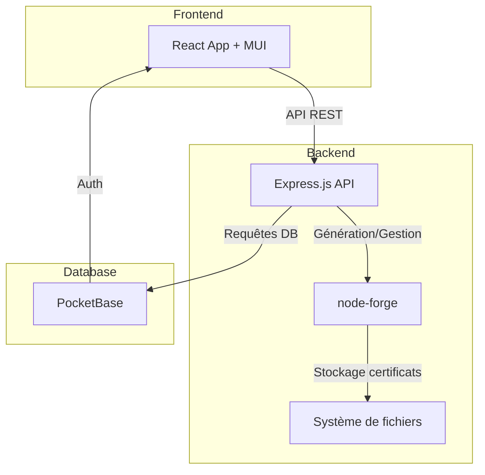
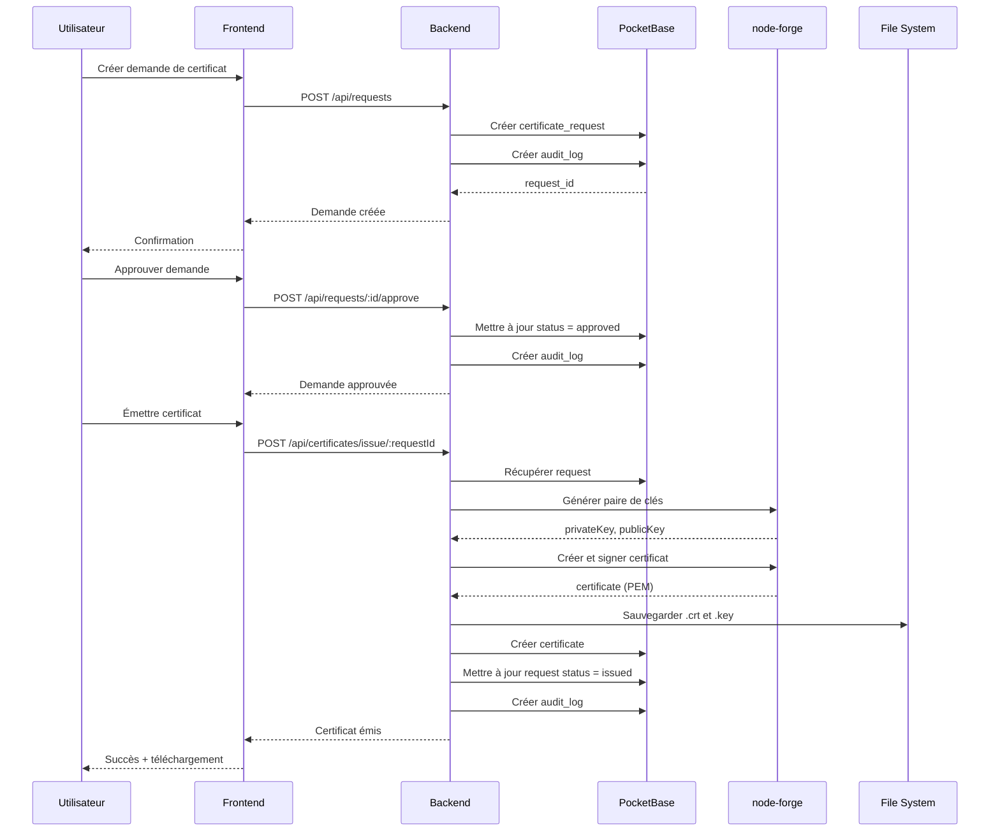
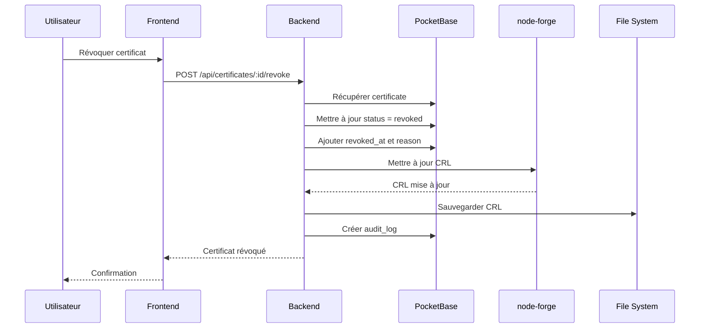
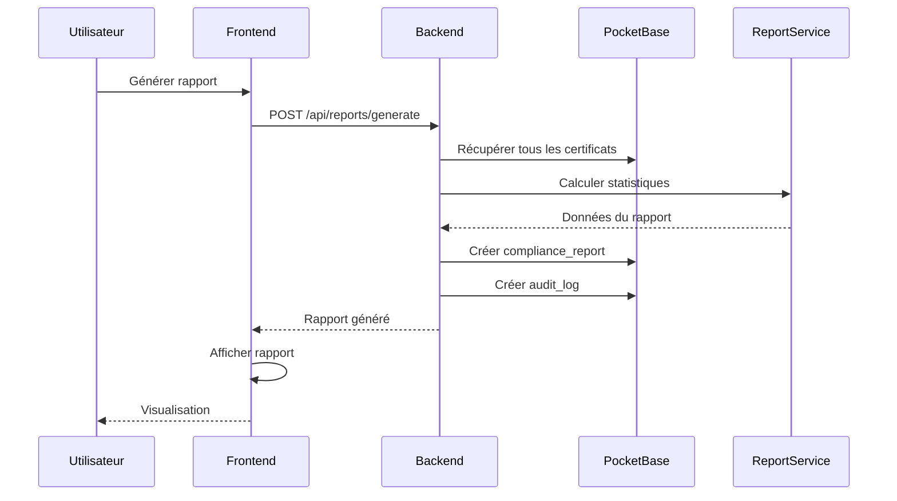

# Plan d'Application de Gestion d'Autorité de Certification (CA)

## Vue d'ensemble

Application web simple pour gérer une autorité de certification locale destinée à une petite équipe IT (10-50 certificats SSL/TLS).

### Stack Technique
- **Frontend**: React + Material-UI (MUI)
- **Backend**: Node.js + Express.js
- **Base de données**: PocketBase
- **Gestion des certificats**: node-forge (bibliothèque JavaScript pure)
- **Authentification**: PocketBase Auth

---

## Architecture Globale



---

## 1. Schéma de Base de Données (PocketBase)

### Collection: `certificate_requests`
Demandes de certificats

| Champ | Type | Description |
|-------|------|-------------|
| id | text | ID auto-généré |
| common_name | text | Nom commun (CN) du certificat |
| organization | text | Organisation |
| organizational_unit | text | Unité organisationnelle |
| country | text | Pays (code 2 lettres) |
| state | text | État/Province |
| locality | text | Ville |
| email | email | Email de contact |
| san_dns | json | Liste des Subject Alternative Names (DNS) |
| san_ip | json | Liste des Subject Alternative Names (IP) |
| key_size | number | Taille de la clé (2048, 4096) |
| validity_days | number | Durée de validité en jours |
| status | select | pending, approved, rejected, issued |
| requested_by | relation | Utilisateur demandeur |
| requested_at | date | Date de demande |
| notes | text | Notes/commentaires |
| created | date | Auto |
| updated | date | Auto |

### Collection: `certificates`
Certificats émis

| Champ | Type | Description |
|-------|------|-------------|
| id | text | ID auto-généré |
| request_id | relation | Lien vers certificate_requests |
| serial_number | text | Numéro de série unique |
| common_name | text | CN du certificat |
| subject | json | Informations complètes du sujet |
| issuer | json | Informations de l'émetteur (CA) |
| not_before | date | Date de début de validité |
| not_after | date | Date de fin de validité |
| fingerprint_sha256 | text | Empreinte SHA-256 |
| certificate_pem | text | Certificat au format PEM |
| certificate_path | text | Chemin du fichier .crt |
| private_key_path | text | Chemin de la clé privée |
| status | select | active, expired, revoked |
| issued_at | date | Date d'émission |
| issued_by | relation | Utilisateur émetteur |
| revoked_at | date | Date de révocation (si applicable) |
| revocation_reason | select | unspecified, keyCompromise, caCompromise, affiliationChanged, superseded, cessationOfOperation |
| created | date | Auto |
| updated | date | Auto |

### Collection: `ca_config`
Configuration de l'autorité de certification

| Champ | Type | Description |
|-------|------|-------------|
| id | text | ID auto-généré |
| ca_name | text | Nom de la CA |
| ca_certificate_pem | text | Certificat racine CA (PEM) |
| ca_private_key_encrypted | text | Clé privée CA chiffrée |
| ca_serial_number | number | Dernier numéro de série utilisé |
| ca_not_before | date | Date de début CA |
| ca_not_after | date | Date de fin CA |
| default_validity_days | number | Durée par défaut (365) |
| default_key_size | number | Taille de clé par défaut (2048) |
| crl_distribution_point | text | URL du CRL |
| created | date | Auto |
| updated | date | Auto |

### Collection: `audit_logs`
Journal d'audit

| Champ | Type | Description |
|-------|------|-------------|
| id | text | ID auto-généré |
| action | select | create_request, approve_request, reject_request, issue_certificate, revoke_certificate, renew_certificate, download_certificate, view_certificate |
| entity_type | select | certificate_request, certificate, ca_config |
| entity_id | text | ID de l'entité concernée |
| user | relation | Utilisateur ayant effectué l'action |
| details | json | Détails supplémentaires |
| ip_address | text | Adresse IP |
| timestamp | date | Auto |
| created | date | Auto |

### Collection: `compliance_reports`
Rapports de conformité

| Champ | Type | Description |
|-------|------|-------------|
| id | text | ID auto-généré |
| report_type | select | monthly, quarterly, annual, on_demand |
| period_start | date | Début de la période |
| period_end | date | Fin de la période |
| total_certificates | number | Nombre total de certificats |
| active_certificates | number | Certificats actifs |
| expired_certificates | number | Certificats expirés |
| revoked_certificates | number | Certificats révoqués |
| expiring_soon | number | Certificats expirant sous 30 jours |
| report_data | json | Données détaillées du rapport |
| generated_by | relation | Utilisateur générateur |
| generated_at | date | Date de génération |
| created | date | Auto |

---

## 2. Structure du Backend (Node.js/Express)

### Arborescence des fichiers

```
backend/
├── src/
│   ├── config/
│   │   ├── database.js          # Configuration PocketBase
│   │   ├── server.js            # Configuration Express
│   │   └── constants.js         # Constantes (chemins, valeurs par défaut)
│   ├── middleware/
│   │   ├── auth.js              # Middleware d'authentification
│   │   ├── errorHandler.js     # Gestion des erreurs
│   │   └── validator.js         # Validation des requêtes
│   ├── services/
│   │   ├── caService.js         # Gestion de la CA (initialisation, config)
│   │   ├── certificateService.js # Génération/révocation de certificats
│   │   ├── crlService.js        # Gestion de la CRL (Certificate Revocation List)
│   │   ├── auditService.js      # Journalisation des actions
│   │   └── reportService.js     # Génération de rapports
│   ├── routes/
│   │   ├── auth.js              # Routes d'authentification
│   │   ├── requests.js          # Routes pour les demandes
│   │   ├── certificates.js      # Routes pour les certificats
│   │   ├── ca.js                # Routes pour la configuration CA
│   │   ├── reports.js           # Routes pour les rapports
│   │   └── audit.js             # Routes pour l'audit
│   ├── utils/
│   │   ├── crypto.js            # Utilitaires cryptographiques
│   │   ├── fileManager.js       # Gestion des fichiers
│   │   └── validators.js        # Validateurs personnalisés
│   └── app.js                   # Point d'entrée de l'application
├── storage/
│   ├── ca/                      # Certificat et clé de la CA
│   ├── certificates/            # Certificats émis
│   ├── private_keys/            # Clés privées (protégées)
│   └── crl/                     # Certificate Revocation Lists
├── package.json
└── .env                         # Variables d'environnement
```

### Dépendances principales

```json
{
  "dependencies": {
    "express": "^4.18.0",
    "node-forge": "^1.3.1",
    "pocketbase": "^0.21.0",
    "dotenv": "^16.0.0",
    "cors": "^2.8.5",
    "helmet": "^7.0.0",
    "express-rate-limit": "^7.0.0",
    "joi": "^17.9.0",
    "winston": "^3.10.0"
  }
}
```

---

## 3. Endpoints API REST

### Authentification
- `POST /api/auth/login` - Connexion
- `POST /api/auth/logout` - Déconnexion
- `GET /api/auth/me` - Informations utilisateur

### Demandes de certificats
- `GET /api/requests` - Liste des demandes
- `GET /api/requests/:id` - Détails d'une demande
- `POST /api/requests` - Créer une demande
- `PUT /api/requests/:id` - Modifier une demande (si pending)
- `DELETE /api/requests/:id` - Supprimer une demande (si pending)
- `POST /api/requests/:id/approve` - Approuver une demande
- `POST /api/requests/:id/reject` - Rejeter une demande

### Certificats
- `GET /api/certificates` - Liste des certificats
- `GET /api/certificates/:id` - Détails d'un certificat
- `POST /api/certificates/issue/:requestId` - Émettre un certificat
- `POST /api/certificates/:id/revoke` - Révoquer un certificat
- `POST /api/certificates/:id/renew` - Renouveler un certificat
- `GET /api/certificates/:id/download` - Télécharger certificat (.crt)
- `GET /api/certificates/:id/download-key` - Télécharger clé privée (.key)
- `GET /api/certificates/:id/download-bundle` - Télécharger bundle (.zip)
- `GET /api/certificates/expiring` - Certificats expirant bientôt

### Configuration CA
- `GET /api/ca/config` - Configuration actuelle
- `POST /api/ca/initialize` - Initialiser la CA (première fois)
- `PUT /api/ca/config` - Mettre à jour la configuration
- `GET /api/ca/certificate` - Télécharger le certificat CA
- `GET /api/ca/crl` - Télécharger la CRL

### Rapports
- `GET /api/reports` - Liste des rapports
- `GET /api/reports/:id` - Détails d'un rapport
- `POST /api/reports/generate` - Générer un rapport
- `GET /api/reports/:id/download` - Télécharger rapport (PDF/JSON)

### Audit
- `GET /api/audit/logs` - Journal d'audit (avec filtres)
- `GET /api/audit/logs/:id` - Détails d'une entrée

---

## 4. Interface Frontend (React + MUI)

### Arborescence des fichiers

```
frontend/
├── public/
│   └── index.html
├── src/
│   ├── components/
│   │   ├── layout/
│   │   │   ├── AppBar.jsx           # Barre de navigation
│   │   │   ├── Sidebar.jsx          # Menu latéral
│   │   │   └── Layout.jsx           # Layout principal
│   │   ├── certificates/
│   │   │   ├── CertificateList.jsx  # Liste des certificats
│   │   │   ├── CertificateCard.jsx  # Carte certificat
│   │   │   ├── CertificateDetails.jsx # Détails certificat
│   │   │   └── CertificateActions.jsx # Actions (révocation, téléchargement)
│   │   ├── requests/
│   │   │   ├── RequestList.jsx      # Liste des demandes
│   │   │   ├── RequestForm.jsx      # Formulaire de demande
│   │   │   ├── RequestCard.jsx      # Carte demande
│   │   │   └── RequestApproval.jsx  # Approbation/rejet
│   │   ├── reports/
│   │   │   ├── ReportList.jsx       # Liste des rapports
│   │   │   ├── ReportGenerator.jsx  # Générateur de rapports
│   │   │   └── ReportViewer.jsx     # Visualisation rapport
│   │   ├── audit/
│   │   │   ├── AuditLog.jsx         # Journal d'audit
│   │   │   └── AuditFilters.jsx     # Filtres d'audit
│   │   ├── ca/
│   │   │   ├── CAConfig.jsx         # Configuration CA
│   │   │   ├── CAInitialize.jsx     # Initialisation CA
│   │   │   └── CAStatus.jsx         # Statut CA
│   │   └── common/
│   │       ├── StatusChip.jsx       # Chip de statut
│   │       ├── DateDisplay.jsx      # Affichage de date
│   │       ├── ConfirmDialog.jsx    # Dialog de confirmation
│   │       └── LoadingSpinner.jsx   # Indicateur de chargement
│   ├── pages/
│   │   ├── Dashboard.jsx            # Tableau de bord
│   │   ├── Certificates.jsx         # Page certificats
│   │   ├── Requests.jsx             # Page demandes
│   │   ├── Reports.jsx              # Page rapports
│   │   ├── Audit.jsx                # Page audit
│   │   ├── Settings.jsx             # Page paramètres
│   │   └── Login.jsx                # Page connexion
│   ├── services/
│   │   ├── api.js                   # Client API
│   │   ├── auth.js                  # Service d'authentification
│   │   └── pocketbase.js            # Client PocketBase
│   ├── hooks/
│   │   ├── useAuth.js               # Hook d'authentification
│   │   ├── useCertificates.js       # Hook certificats
│   │   └── useRequests.js           # Hook demandes
│   ├── context/
│   │   └── AuthContext.jsx          # Contexte d'authentification
│   ├── utils/
│   │   ├── formatters.js            # Formatage de données
│   │   └── validators.js            # Validation de formulaires
│   ├── theme/
│   │   └── theme.js                 # Thème MUI personnalisé
│   ├── App.jsx                      # Composant principal
│   └── index.jsx                    # Point d'entrée
├── package.json
└── .env                             # Variables d'environnement
```

### Pages principales

#### 1. Dashboard (Tableau de bord)
- **Widgets**:
  - Nombre total de certificats actifs
  - Certificats expirant dans 30 jours
  - Demandes en attente
  - Dernières actions (audit)
- **Graphiques**:
  - Évolution des certificats émis (par mois)
  - Répartition par statut (actif/expiré/révoqué)

#### 2. Certificates (Gestion des certificats)
- **Liste**: Tableau avec filtres (statut, date d'expiration, CN)
- **Actions**: Voir détails, télécharger, révoquer, renouveler
- **Détails**: Informations complètes, historique, actions

#### 3. Requests (Demandes de certificats)
- **Liste**: Demandes avec statut (pending, approved, rejected, issued)
- **Formulaire**: Création de nouvelle demande
- **Actions**: Approuver, rejeter, émettre certificat

#### 4. Reports (Rapports de conformité)
- **Générateur**: Sélection de période et type
- **Liste**: Rapports générés
- **Visualisation**: Affichage des données, export PDF/JSON

#### 5. Audit (Journal d'audit)
- **Liste**: Toutes les actions avec filtres
- **Filtres**: Par utilisateur, action, date, entité

#### 6. Settings (Paramètres)
- **Configuration CA**: Paramètres de l'autorité
- **Valeurs par défaut**: Durée de validité, taille de clé
- **Profil utilisateur**: Informations personnelles

### Dépendances principales

```json
{
  "dependencies": {
    "react": "^18.2.0",
    "react-dom": "^18.2.0",
    "react-router-dom": "^6.14.0",
    "@mui/material": "^5.14.0",
    "@mui/icons-material": "^5.14.0",
    "@emotion/react": "^11.11.0",
    "@emotion/styled": "^11.11.0",
    "pocketbase": "^0.21.0",
    "axios": "^1.4.0",
    "date-fns": "^2.30.0",
    "recharts": "^2.7.0",
    "react-hook-form": "^7.45.0",
    "yup": "^1.2.0"
  }
}
```

---

## 5. Gestion des Certificats avec node-forge

### Fonctionnalités principales

#### 5.1 Initialisation de la CA

```javascript
// Génération du certificat racine CA auto-signé
// - Clé privée RSA (2048 ou 4096 bits)
// - Certificat X.509 v3
// - Extensions: basicConstraints (CA:TRUE), keyUsage
// - Validité: 10 ans par défaut
```

#### 5.2 Génération de certificat

```javascript
// Processus:
// 1. Générer une paire de clés RSA
// 2. Créer une CSR (Certificate Signing Request)
// 3. Signer avec la clé privée de la CA
// 4. Ajouter les extensions (SAN, keyUsage, etc.)
// 5. Sauvegarder au format PEM
```

#### 5.3 Révocation de certificat

```javascript
// Processus:
// 1. Marquer le certificat comme révoqué dans la DB
// 2. Ajouter à la CRL (Certificate Revocation List)
// 3. Mettre à jour la CRL
// 4. Enregistrer dans l'audit
```

#### 5.4 Renouvellement de certificat

```javascript
// Processus:
// 1. Vérifier que le certificat existe
// 2. Créer une nouvelle demande avec les mêmes paramètres
// 3. Générer un nouveau certificat
// 4. Marquer l'ancien comme "superseded"
```

#### 5.5 Gestion de la CRL

```javascript
// Certificate Revocation List:
// - Format X.509 CRL v2
// - Mise à jour automatique lors de révocations
// - Accessible via endpoint public
// - Signature par la CA
```

---

## 6. Flux de Travail des Opérations

### 6.1 Flux de demande et émission de certificat



### 6.2 Flux de révocation de certificat



### 6.3 Flux de génération de rapport



---

## 7. Sécurité

### 7.1 Stockage des clés privées

- **Clé privée CA**: Chiffrée avec un mot de passe maître (stocké dans variable d'environnement)
- **Clés privées des certificats**: Stockées dans un répertoire protégé avec permissions restrictives
- **Accès**: Uniquement via l'API backend, jamais exposées directement

### 7.2 Authentification et autorisation

- **PocketBase Auth**: Gestion des utilisateurs et sessions
- **JWT**: Tokens pour l'authentification API
- **Rôle unique**: Admin (pour simplifier)

### 7.3 Audit et traçabilité

- **Toutes les actions** sont enregistrées dans [`audit_logs`](pocketbase://collections/audit_logs)
- **Informations capturées**: Utilisateur, action, entité, timestamp, IP
- **Immuabilité**: Les logs ne peuvent pas être modifiés

### 7.4 Protection de l'API

- **Rate limiting**: Limitation du nombre de requêtes
- **CORS**: Configuration stricte
- **Helmet**: Headers de sécurité HTTP
- **Validation**: Validation stricte des entrées avec Joi

---

## 8. Déploiement

### 8.1 Structure de déploiement

```
SimpleCertManager/
├── backend/              # Backend Node.js
├── frontend/             # Frontend React (build)
├── pocketbase/           # Instance PocketBase
│   ├── pb_data/         # Données PocketBase
│   └── pocketbase       # Exécutable PocketBase
└── docker-compose.yml   # (Optionnel) Configuration Docker
```

### 8.2 Variables d'environnement

**Backend (.env)**:
```
PORT=3001
POCKETBASE_URL=http://localhost:8090
CA_PASSWORD=<mot_de_passe_fort>
STORAGE_PATH=./storage
NODE_ENV=production
```

**Frontend (.env)**:
```
REACT_APP_API_URL=http://localhost:3001/api
REACT_APP_POCKETBASE_URL=http://localhost:8090
```

### 8.3 Commandes de démarrage

```bash
# PocketBase
cd pocketbase && ./pocketbase serve

# Backend
cd backend && npm install && npm start

# Frontend (dev)
cd frontend && npm install && npm start

# Frontend (production)
cd frontend && npm run build
```

---

## 9. Fonctionnalités Futures (Hors scope initial)

- Support de plusieurs types de certificats (client, code signing)
- Gestion de plusieurs CA (intermédiaires)
- Intégration ACME (Let's Encrypt style)
- Notifications par email (expiration, révocation)
- Support HSM (Hardware Security Module)
- API SCEP (Simple Certificate Enrollment Protocol)
- Interface multi-utilisateurs avec rôles avancés
- Intégration LDAP/Active Directory
- Backup automatique
- Monitoring et alertes

---

## 10. Prochaines Étapes d'Implémentation

### Phase 1: Configuration de base
1. Initialiser les projets (backend, frontend)
2. Configurer PocketBase et créer les collections
3. Mettre en place l'authentification

### Phase 2: Backend Core
4. Implémenter les services de gestion CA avec node-forge
5. Créer les endpoints API REST
6. Mettre en place le système d'audit

### Phase 3: Frontend Core
7. Créer le layout et la navigation
8. Implémenter les pages principales (Dashboard, Certificates, Requests)
9. Intégrer l'authentification

### Phase 4: Fonctionnalités avancées
10. Implémenter la gestion de la CRL
11. Créer le système de rapports
12. Ajouter la page d'audit

### Phase 5: Tests et déploiement
13. Tests d'intégration
14. Documentation utilisateur
15. Déploiement et configuration production

---

## Résumé

Cette application fournira une solution simple et efficace pour gérer une autorité de certification locale avec:

- ✅ **Stack JavaScript unifié** (React + Node.js)
- ✅ **Interface moderne** avec Material-UI
- ✅ **Gestion complète** des certificats (demande, émission, révocation, renouvellement)
- ✅ **Sécurité** avec audit complet et stockage sécurisé
- ✅ **Rapports de conformité** automatisés
- ✅ **Base de données simple** avec PocketBase
- ✅ **Cryptographie pure JavaScript** avec node-forge (pas de dépendance OpenSSL externe)

L'architecture est conçue pour être **simple à déployer** et **facile à maintenir** pour une petite équipe IT.
